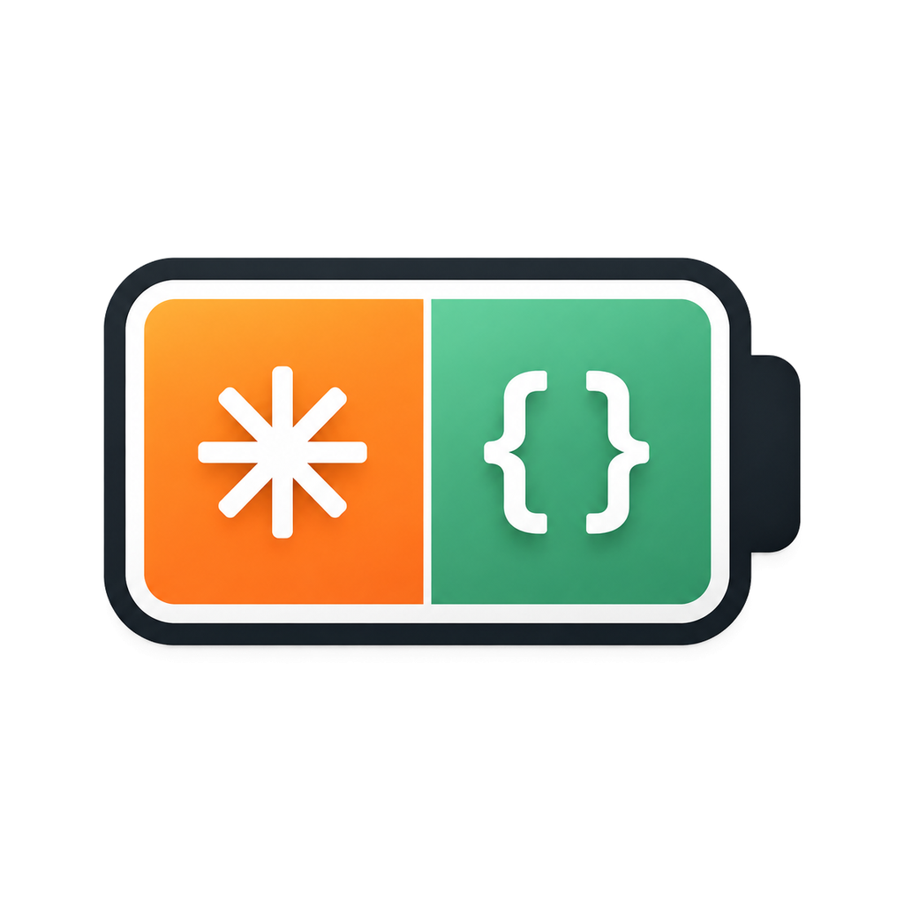
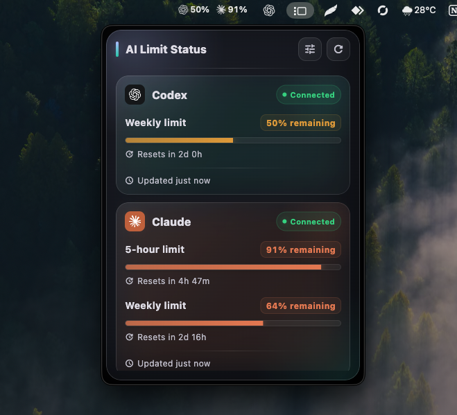
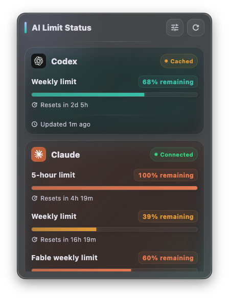

<p align="center">
  
</p>

<h1 align="center">AI Limit Status</h1>

<p align="center">
  Monitor Codex and Claude usage limits from your macOS menu bar or Windows
  taskbar.
</p>

<p align="center">
  <a href="https://github.com/farhans-codes/ai_limit_status/releases/latest"></a>
  <a href="https://github.com/farhans-codes/ai_limit_status/actions/workflows/ci.yml"></a>
  <a href="LICENSE"></a>
  
</p>

AI Limit Status is a lightweight, open-source Flutter desktop companion that
keeps subscription usage visible without interrupting your workflow. It uses
the macOS menu bar and an experimental Windows taskbar overlay, refreshes
connected providers automatically, and does not include analytics or telemetry.

> [!IMPORTANT]
> AI Limit Status is an independent community project. It is not affiliated
> with, endorsed by, or sponsored by OpenAI or Anthropic.

## Screenshots

### Menu bar and popover

<p align="center">
  
</p>

<p align="center"><sub>Real macOS menu-bar indicators and details popover.</sub></p>

### Detailed usage view

<p align="center">
  
</p>

<p align="center"><sub>Real application capture on macOS.</sub></p>

## Download

| Platform | Recommended | Alternative |
| --- | --- | --- |
| macOS | [Download DMG](https://github.com/farhans-codes/ai_limit_status/releases/latest/download/AI-Limit-Status-macOS.dmg) | [Download ZIP](https://github.com/farhans-codes/ai_limit_status/releases/latest/download/AI-Limit-Status-macOS.zip) |
| Windows x64 | [Download Setup EXE](https://github.com/farhans-codes/ai_limit_status/releases/latest/download/AI-Limit-Status-Windows-x64-Setup.exe) | [Download portable ZIP](https://github.com/farhans-codes/ai_limit_status/releases/latest/download/AI-Limit-Status-Windows-x64-portable.zip) |

[View the latest release notes](https://github.com/farhans-codes/ai_limit_status/releases/latest)
or [download SHA-256 checksums](https://github.com/farhans-codes/ai_limit_status/releases/latest/download/AI-Limit-Status-SHA256SUMS.txt).

## Features

- Shows only the providers installed on the current computer.
- Displays available five-hour, weekly, Fable, Opus, and Sonnet usage windows.
- Lets users choose whether the Claude shortcut shows the five-hour or Fable
  weekly limit.
- Keeps Codex and the selected Claude percentages visible in the macOS menu bar
  or side by side in the Windows taskbar.
- Shows the Windows taskbar indicators on a transparent background.
- Refreshes every connected provider automatically every two minutes.
- Opens a compact glass-style details window from the menu-bar or taskbar
  shortcut.
- Plays a bundled custom chime for usage warnings and reset notifications.
- Sends each notification only once per threshold and reset window.
- Offers guided installation and sign-in actions where the platform supports
  them.
- Can launch automatically when the user signs in.
- Keeps the last successful percentage and reset-time snapshot during temporary
  provider or network failures.
- Uses a single English interface across supported platforms.
- Does not include analytics, advertising, or telemetry.

## Status shortcut preference

Open **App settings** to choose the Claude value shown in the macOS menu bar or
Windows taskbar:

- **5-hour limit** shows the normal rolling Claude usage window.
- **Fable weekly limit** shows the scoped Fable allowance reported by Claude.

The Codex indicator remains visible beside the selected Claude value. If Claude
does not report the selected limit, the shortcut shows `—` instead of silently
substituting a different limit.

## Notification rules

Usage notifications play the bundled AI Limit Status chime and apply to both
providers:

- 50% remaining: use the remaining allowance carefully.
- 20% remaining: an extra-caution warning.
- 10% remaining: a warning to reduce usage.

Claude five-hour notifications:

- Five-hour limit restored.
- One hour before reset.
- 30 minutes before reset.
- 10 minutes before reset.

Claude and Codex weekly notifications:

- Weekly limit restored.
- One day before reset.
- 12 hours before reset.
- Five hours before reset.
- One hour before reset.

Codex does not receive five-hour restored or countdown notifications. Each
notification is shown only once for a specific reset window.

## Install and first launch

### macOS

1. Download the macOS DMG.
2. Open it and drag **AI Limit Status** into **Applications**.
3. Open the app from Applications.

Public beta builds may not yet be notarized. If Gatekeeper blocks a verified
GitHub release, Control-click the app, choose **Open**, and confirm once. Never
run a copy downloaded from an untrusted source.

### Windows

1. Download the Windows x64 Setup EXE.
2. Run the installer and follow the setup wizard.
3. Open AI Limit Status from the Start menu.

The live Codex and Claude indicators appear together in the taskbar immediately
to the left of the Windows notification area. Left-click the indicators to open
the details window, or right-click them to open the app menu. The Claude value
can be changed between the five-hour and Fable weekly limits from **App
settings**.

Unsigned public beta builds can trigger Microsoft Defender SmartScreen. Verify
the release checksum and GitHub source before continuing. The installer bundles
the Visual C++ runtime files required by Flutter, so users do not need to install
them separately.

The portable ZIP is also available for users who do not want an installer.
Extract the entire ZIP into a normal folder before opening
`ai_limit_status.exe`; running the executable from inside the compressed archive
prevents Windows from loading the bundled Flutter and Visual C++ DLLs.

## Provider setup

Each provider is independent. Users only need to connect the services they
already use.

On Windows, **Install & sign in** uses the official WinGet packages
`OpenAI.Codex` and `Anthropic.ClaudeCode`, starts the provider-owned sign-in
flow, and checks the connection again.

On macOS, install the provider from the official
[Codex CLI](https://developers.openai.com/codex/cli/) or
[Claude Code](https://code.claude.com/docs/en/getting-started) guide. The app
detects common native, Homebrew, npm, and application-bundled CLI locations.

AI Limit Status does not ask users to paste an API key into the app.

## Privacy and credential handling

- Codex usage is requested through the locally installed `codex app-server`.
  AI Limit Status does not directly read or store Codex credentials.
- Claude usage requires the existing Claude Code OAuth credential. On macOS,
  the app reads it from the `Claude Code-credentials` Keychain entry. On
  Windows, it reads the provider-owned `.claude/.credentials.json` file.
- The Claude access token is held in memory only long enough to request usage
  from `https://api.anthropic.com/api/oauth/usage`. AI Limit Status does not
  write the token to its own files or logs.
- Local cache files contain only remaining percentages, reset timestamps, and
  the last successful update time.
- No usage data is sent to the project maintainer or any analytics service.

Read the complete [privacy statement](PRIVACY.md) and
[security policy](SECURITY.md) before installing the app.

## Known limitations

- Provider CLIs and usage endpoints can change without notice and temporarily
  break usage detection.
- Claude usage currently depends on an OAuth usage endpoint used by Claude Code.
- The Windows taskbar status is an experimental overlay because Windows 11 does
  not provide a supported API for embedding two live custom indicators in the
  taskbar. It currently targets the primary taskbar; Windows Shell updates or
  third-party taskbar replacements can affect its position.
- Code signing and notarization status can differ between releases; always read
  the release notes.
- Windows release builds currently target x64-compatible systems.

## Build from source

Requirements:

- Flutter `3.44.2` or a compatible stable release.
- Xcode command-line tools for macOS builds.
- Visual Studio with **Desktop development with C++** for Windows builds.
- The provider CLIs needed for the limits you want to monitor.

```bash
flutter pub get
flutter analyze
```

Build on the target operating system:

```bash
# macOS
flutter build macos --release

# Windows, from Windows
flutter build windows --release
```

Windows builds cannot be produced directly from macOS. Maintainers can use the
included GitHub Actions workflows for reproducible platform builds.

## Contributing

Contributions are welcome. Read [CONTRIBUTING.md](CONTRIBUTING.md), follow the
[Code of Conduct](CODE_OF_CONDUCT.md), and use the repository issue templates
before opening a pull request.

Security vulnerabilities must not be posted in public issues. Follow
[SECURITY.md](SECURITY.md) instead.

## License and trademarks

The source code is available under the [MIT License](LICENSE).

OpenAI, Codex, Anthropic, Claude, and their logos are trademarks of their
respective owners. The MIT License does not grant rights to third-party names,
logos, or marks. See [NOTICE.md](NOTICE.md).
